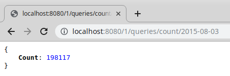

Testolia: a query log parser server
===================================

## Table of Contents

1. [About](#about)
2. [Installation](#installation)
3. [Testing](#testing)
4. [Initial assignment](#initialAssignement)

## About
This go program creates a server that allows to print a report of a log file on demand. It can either count the distinct request during a timeframe, or print a object listing the popular searches during a timeframe:

### What's inside

The program is written in go, with no external lib used.

### How it works
 
1. The file is read, every line is splitted in two strings `timestamp` and `query`.
2. The data is stored in a slice, that we sort against the timestamp key. The timestamps are properly formatted, so sorting alphabetically yields a proper sort by timestamp
3. At this point the server can start listening to queries
4. When receiving a request, find the first maching index of the sorted data (using a binary sort, thus `O(log(n))`), scan every line that matches the query (simple scan until the matching condition fails) and reduce to provide the desired output.

## Installation & usage

This program can either be installed using a go environment, or via a provided Dockerfile

### 1. Install with go
run `go build` to create the `testolia` executable and run it with `./testolia <filename>`

The `<filename>` argument can either be a `.tsv` file, or a gzipped `.tsv.gz` file
 
### 2. Build docker image

- build the image with `docker build -t testolia .`
- run it with `docker run -v <your-local-file>:/tmp/log.gz -p 8080:8080 testolia /tmp/log.gz`

### 3. Use prebuilt image

- Without even cloning this repo, you can run my prebuilt image: `docker run -v <your-local-file>:/tmp/log.gz -p 8080:8080 aherve/testolia /tmp/log.gz`

## Testing

go test files are present and can be launched using `go test`

I've also setup a CI: 

## Limitations & possible improvements

- I hope I didn't step on too many naming conventions, go-specific patterns or so. This is the first time I write something in go so I'm hoping this is easily readable by more experienced go developers
- The algo basically keeps all data in memory. This allows quite fast response times (with about 1.6M lines, the server boots in about 1.5s and always respond under 300ms on my personal computer), but also has its limitations since it will consume more RAM as the input grows.
- The error handling is really basic: just panic if anything goes wrong. I'd advocate to set at least a treshold on how many missed lines the loading script tolerates before throwing a panic
- There is close to no server logging, this would obviously be mandatory to create something production-proof.

## Initial Assignment

[ Initial assignment can be found here ](https://gist.github.com/sfriquet/55b18848d6d58b8185bbada81c620c4a)
